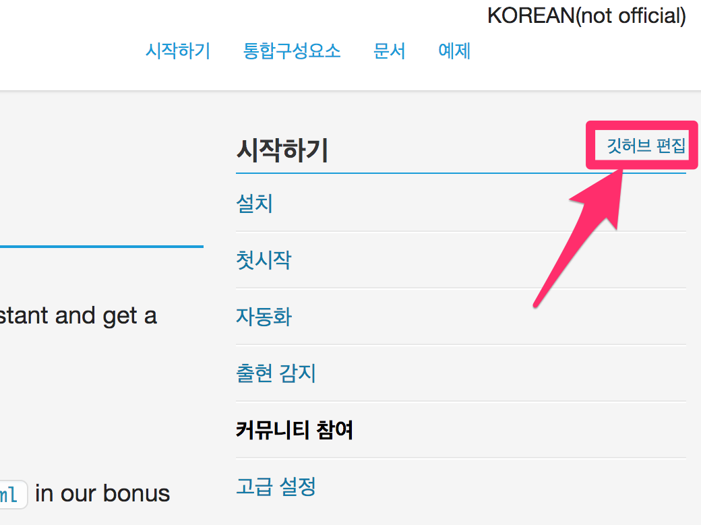
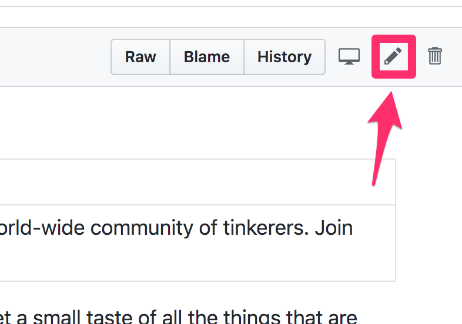
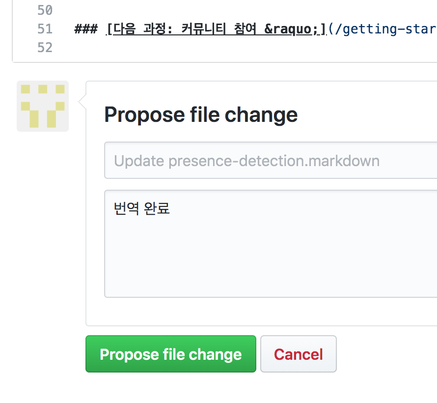
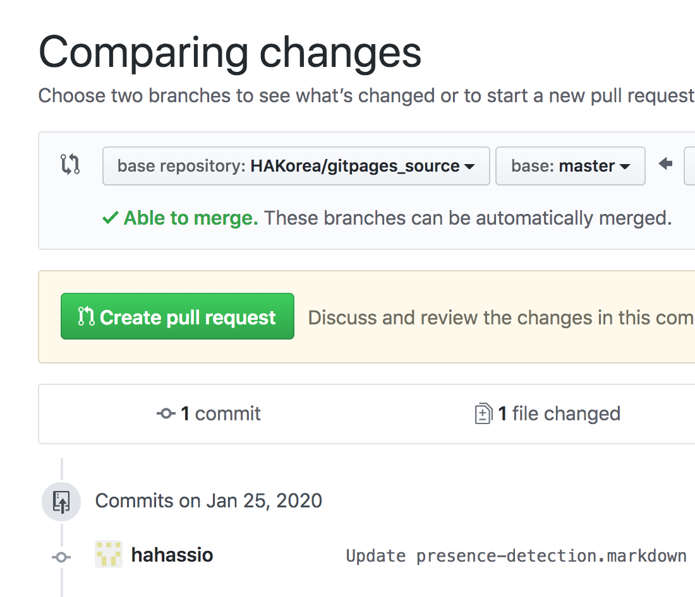
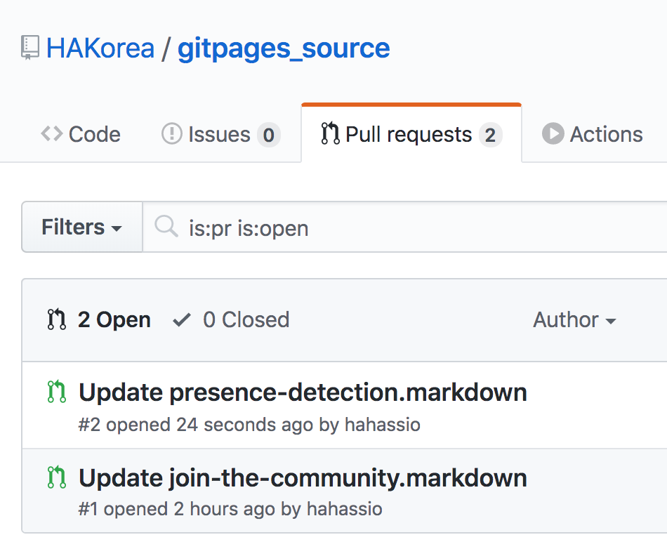

# Home Assistant Korean Docs

This is the source for the [Home Assistant Korea Docs Site](https://hakorea.github.io).

이 곳은 [홈어시스턴트 문서 번역 사이트](https://hakorea.github.io)의 소스코드를 보관한 곳입니다.

## 번역 지원

한국어 번역에 도움을 주실 분은 이메일 m@zooil.com 로 문의바랍니다.

Jekyll을 사용하는 기본적인 방법은 원문 사이트와 동일합니다 [developer documentation](https://developers.home-assistant.io/docs/documentation_index.html).

## 온라인 번역 제안

[홈어시스턴트 한국어 사이트](https://hakorea.github.io)를 둘러보다 번역이 미흡하거나 새로운 영문 문서를 번역하려면 `깃허브 편집` 링크를 눌러 번역 제안을 할 수 있습니다. 번역 제안을 하기 위해서는 깃허브에 로그인한 상태여야 합니다.

1. 사이트를 살펴보다가 제안 하고 싶은 내용이 있다면 `깃허브 편집`을 클릭합니다.

2. 번역 문서의 소스코드(마크다운 파일)가 화면에 나타나면 `연필` 모양의 편집 버튼을 누릅니다.

3. 온라인 에디터에서 번역을 완료합니다. 번역은 "습니다"로 끝나는 경어체로 작성 해주시기 바랍니다. 제일 하단에 `Propose file change` 에서 description으로 `번역 완료` 또는 `용어 변경 제안` 등 충분한 설명을 기입하고 `Propose file change` 버튼을 눌러 제안을 완료합니다.

4. 번역 제안이 완료되면 풀리퀘스트(Pull Request/반영 요청) 페이지가 나타납니다. `Create Pull Request` 버튼을 눌러 리뷰 요청을 합니다.

5. 번역을 위한 사이트에 풀리퀘스트가 접수됩니다. 이제 리뷰를 기다리면 됩니다.

이렇게 제안한 번역은 본인의 저장소에 포크(fork)되며 번역 요청은 일정 시간 후 리뷰를 거쳐 번역 사이트에 반영됩니다.

번역 규칙 : https://github.com/HAKorea/gitpages_source/wiki
