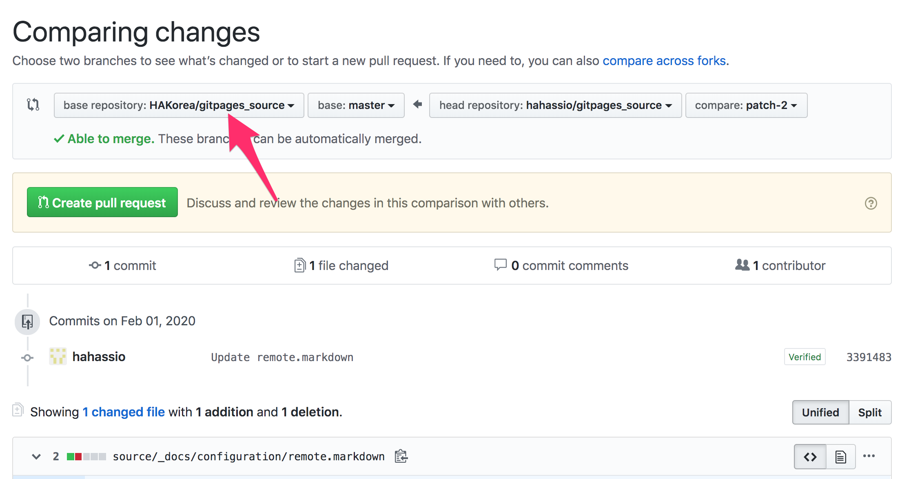
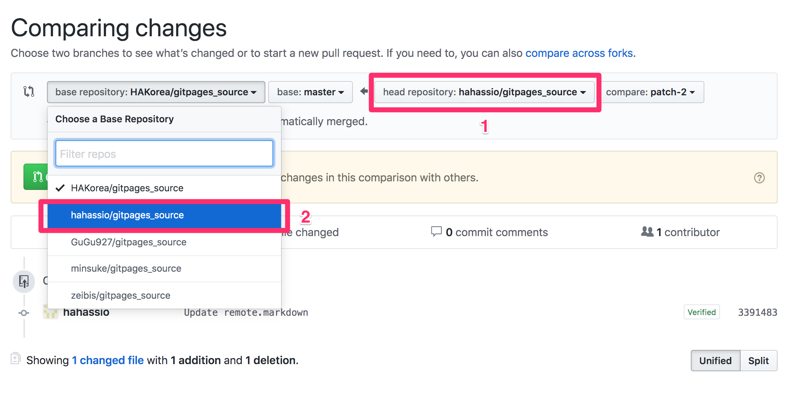
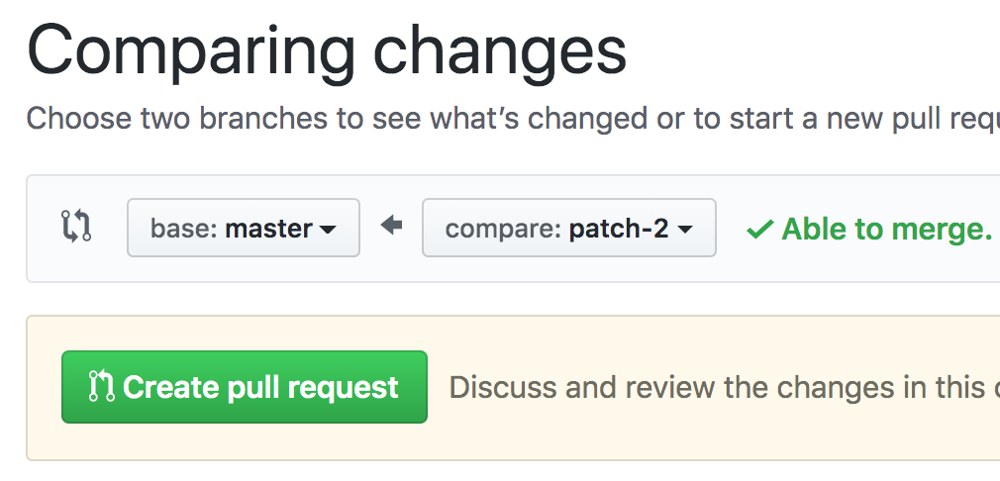
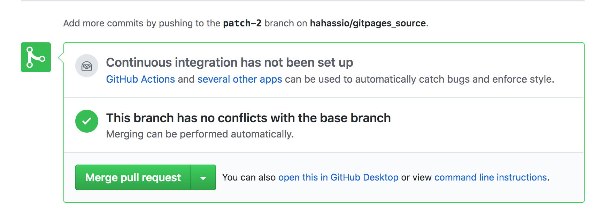
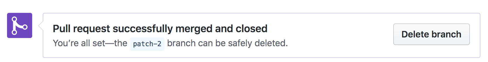
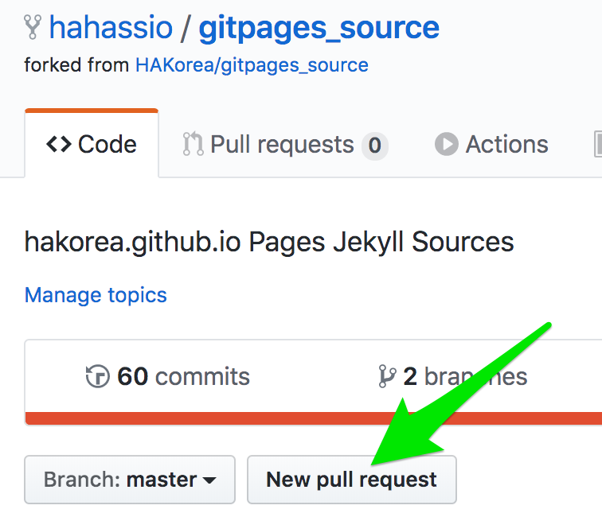
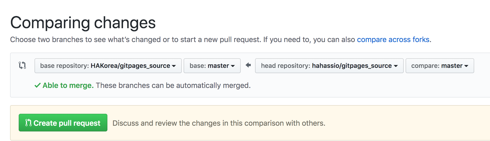
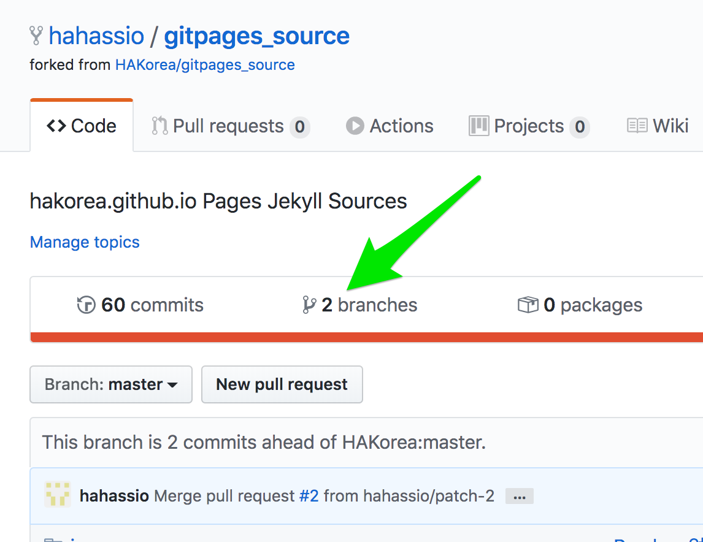
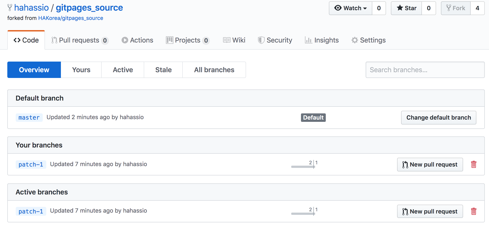

# Home Assistant Korean Docs

This is the source for the [Home Assistant Korea Docs Site](https://hakorea.github.io).

이 곳은 [홈어시스턴트 문서 번역 사이트](https://hakorea.github.io)의 소스코드를 보관한 곳입니다.

## 번역 지원

한국어 번역에 도움을 주실 분은 아래 온라인 편집 방법을 참고하세요.

Jekyll을 사용하는 기본적인 방법은 원문 사이트와 동일합니다 [developer documentation](https://developers.home-assistant.io/docs/documentation_index.html).

## 온라인 번역 제안

[홈어시스턴트 한국어 사이트](https://hakorea.github.io)를 둘러보다 번역이 미흡하거나 새로운 영문 문서를 번역하려면 `깃허브 편집` 링크를 눌러 번역 제안을 할 수 있습니다. 번역 제안을 하기 위해서는 깃허브에 로그인한 상태여야 합니다.

1. 사이트를 살펴보다가 제안 하고 싶은 내용이 있다면 `깃허브 편집`을 클릭합니다.

2. 번역 문서의 소스코드(마크다운 파일)가 화면에 나타나면 `연필` 모양의 편집 버튼을 누릅니다.

3. 온라인 에디터에서 번역을 완료합니다. 번역은 "습니다"로 끝나는 경어체로 작성 해주시기 바랍니다. 제일 하단에 `Propose file change` 에서 description으로 `번역 완료` 또는 `용어 변경 제안` 등 충분한 설명을 기입하고 `Propose file change` 버튼을 눌러 제안을 완료합니다.

4. 번역 제안이 완료되면 풀리퀘스트(Pull Request/반영 요청) 페이지가 나타납니다. `Create Pull Request` 버튼을 눌러 리뷰 요청을 합니다.

5. 번역을 위한 사이트에 풀리퀘스트가 접수됩니다. 이제 리뷰를 기다리면 됩니다.

이렇게 제안한 번역은 본인의 저장소에 포크(fork)되며 번역 요청은 일정 시간 후 리뷰를 거쳐 번역 사이트에 반영됩니다. 매주 주말에 반영을 목표로 하고 있으니 적어도 1주일 이내에 반영됩니다~^^

***
###깃허브 웹페이지에서 처음 풀리퀘스트를 날린 이후에 다시 깃허브 페이지를 편집할때 순서입니다.
1. 처음 번역을 했다면 본인의 저장소에 HAKorea/gitpages_source가 복제됩니다. 이 과정을 포크라고 부르며 MyGitID/gitpages_source 가 나의 저장소가 됩니다.

2. HAKorea.github.io 페이지를 보다기 `깃허브 편집` 버튼을 누르면 위 2번 그림에서 처럼 연필 아이콘을 눌러 편집합니다.

3. 이번에 저장을 완료(propose file change)하면 아래와 같은 이미지가 나옵니다. 여기서 바로 HAKorea/gitpages_source의 master에 풀리퀘스트를 보낼 수도 있습니다. 하지만 한장 한장 여러장을 번역하고 풀리퀘스트를 보내고 싶다면 왼쪽에서 MyGitID/gitpages_source 를 선택합니다.

4. 왼쪽과 오른쪽을 같은 저장공간인 MyGitID/gitpages_source 를 선택합니다. 나의 master가 최종 완성본이고 방금 편집한 것은 patch-1이나 patch-# 와 같이 나타납니다.

5. 나의 저장소로 선택하면 간략하게 master와 patch-#로 보이고 Able to merge 라는 녹색글자가 보입니다. 이제 내 master 저장소로 Create pull request 하세요.

6. 다음 화면에서 Merge pull request 버튼을 누르면 수정한 내용이 나의 저장소 master 브랜치에 합쳐집니다.

7. master 에 편집한 내용을 합친 다음엔 필요없으므로 다음 화면에서 Delete branch 를 눌러 제거합니다. 걱정마세요. 수정한 내용은 master 브랜치에 이미 들어갔습니다.

8. 나의 master 브랜치(완성본이 담긴 곳)를 HAKorea에 보내고 싶다면 MyGitID/gitpages_source에서(Code페이지) New pull request 버튼을 누르면 됩니다.

9. 앞서 본 화면과 비슷한데 이번에는 hakorea/gitpages_source의 master와 MyGitID/gitpages_source의 master를 Create pull request버튼을 눌러 통합해달라는 제안을 보냅니다.

10. 이 과정을 반복하여 깃허브에서 페이지를 번역해 볼 수 있습니다.
***
### 나의 깃허브 저장소에 브랜치가 쌓인다면
브랜치는 온라인에서 편집을 할 수록 path-# 이란 이름으로 나뉩니다. 이걸 한꺼번에 master에 통합할 수도 있고 통합 이후엔 삭제해주는게 헷갈리지 않습니다.
branches에 숫자 2 이상이라면 master가 아닌 다른 브랜치가 쌓여있을 수 있습니다.

이 경우엔 branches를 눌러 삭제하세요. 이곳에서 master에 pull request를 보낼 수도 있습니다. 따라서 편집하고 나중에 한꺼번에 이 화면에서 master에 합친 다음 삭제할 수도 있지요. 

번역 규칙 : https://github.com/HAKorea/gitpages_source/wiki
